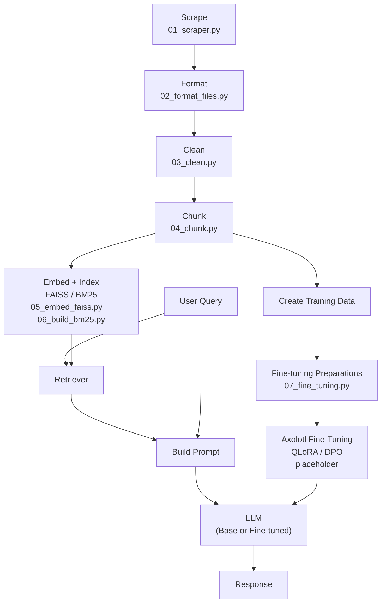

# wm_bot

> A retrieval-augmented generation (RAG) chatbot for answering questions about William & Mary, powered by a 3-stage hybrid retrieval pipeline (FAISS + BM25 + CrossEncoder reranking) and a QLoRA fine-tuned TinyLlama model served via a Gradio UI.


**GitHub Repository:** https://github.com/sjhendricks/wm_bot

--- 

## Project Goal
The goal of this project is to collect and organize information from William & Mary websites to build a system that answers questions about William & Mary.

We scrape relevant webpages, extract clean text, and store results in a structured format used for retrieval-augmented generation (RAG). A 3-stage hybrid retrieval system (FAISS → BM25 → CrossEncoder reranking) fetches the most relevant passages, which are passed as context to a QLoRA fine-tuned LLM to generate grounded answers via a Gradio interface.

The pipeline supports fine-tuning and inference with three interchangeable models: **Llama 3**, **Gemma**, and **Mistral**.

---

## Project Structure

```
wm_bot/
├── scripts/                    # All pipeline scripts
├── envs/
│   ├── wmbot-env_full.yaml     # Full scraping environment spec
│   ├── wmbot-stable.yaml       # Stable scraping environment spec
│   └── llm-env_new.yaml        # LLM/retrieval environment spec
├── data/
│   ├── raw/                    # Raw scraped files (organized by site)
│   ├── clean/                  # Cleaned and formatted text
│   ├── rag/                    # chunks.json, faiss.index, bm25.pkl
│   └── fine_tuning/            # Training data + qlora-out/ adapters
├── metadata/                   # Seed URLs and tracking files
├── logs/                       # Run logs and error logs
└── README.md
```
---

## Scripts

### Core Pipeline

| Script | Description | 
|--------|-------------|
| `01_scraper.py` | scrapes data from different sites (listed in metadata) |
| `02_format_files.py` | uses trifilatura to clean html extras from sites |
| `03_clean.py` | cleans the data |
| `04_chunk_data.py` | chunks the data |
| `05_embed_faiss.py` | FAISS embeddings|
| `06_build_bm25.py` | builds BM25 for retrieval |
| `07_fine_tuning.py` | fine-tunes |
| `08_conversation_format.py` | formats jsonl for input to axolotl |
| `09_app.py` | full RAG chatbot: retrieval + LLM generation + Gradio UI | 

### Environment Setup

| Script | Description | 
|--------|-------------|
| `00_create_scraping_env.sh` | creates environment for scraping and preparing data |
| `00_create_llm_env.sh` | creates environment for training the llm using axolotl |
| `00_create_run_bot_env.sh` | creates environment for running the bot using pytorch | 

### HPC (SLURM) Submit Scripts 

| Script | Description | 
|--------|-------------|
| `submit_scraper.sh` | submits scraping job |
| `submit_cleaner.sh` | submits formatting job |
| `submit_reformat.sh` | submits conversation formatting job |
| `submit_axolotl_model.sh` | submits fine-tuning with selectable model (see Model Selection) |
| `submit_retrieve.sh` | submits retrieval job |

### Supporting Scripts

| Script | Description |
|--------|-------------|
| `cleaning_pipeline_pt1.sh` | allows filename changes before cleaning |
| `cleaning_pipeline_pt2.sh` | runs scripts 03–06 as a pipeline |
| `master_pipeline.sh` | end-to-end pipeline runner |
| `wm_bot_rag.py` | RAG pipeline module |

---

## Pipeline Overview 



---

## Retrieval Architecture

The retrieval system uses 3 stages to maximize answer quality:

1. **FAISS semantic search** — encodes the query with `all-MiniLM-L6-v2` and retrieves the top-K semantically similar chunks
2. **BM25 keyword search** — runs a parallel keyword search to catch exact-match results that semantic search may miss
3. **CrossEncoder reranking** — combines and deduplicates both result sets, reranks with `ms-marco-MiniLM-L-6-v2`, and passes the top 3 passages as LLM context

---

## Model
 
The pipeline supports three interchangeable models for fine-tuning and inference:

```bash
sbatch scripts/submit_axolotl_model.sh llama    # Meta-Llama-3-8B-Instruct
sbatch scripts/submit_axolotl_model.sh gemma    # Gemma
sbatch scripts/submit_axolotl_model.sh mistral  # Mistral (default)
```

| Component | Value |
|-----------|-------|
| Supported LLMs | Llama 3 8B Instruct, Gemma, Mistral |
| Default model | Mistral |
| Fine-tuning method | QLoRA via Axolotl |
| Adapter path | `data/fine_tuning/qlora-out/` |
| Embedding model | `sentence-transformers/all-MiniLM-L6-v2` |
| Reranker | `cross-encoder/ms-marco-MiniLM-L-6-v2` |
| UI | Gradio |

System prompt: *"You are a helpful William and Mary Advisor. Be concise and professional."*

---

## Data Sources

Scraped content is organized by site under `data/raw/`:

| Source | Directory |
|--------|-----------|
| W&M main site | `wm_edu/` |
| Course catalog | `catalog/` |
| W&M news | `news/` |
| W&M library | `wm_library/` |
| Law school | `law/` |
| Flat Hat (student newspaper) | `flathat/` |
| Dining | `dininghub/` |
| Recreation | `rec/` |
| VIMS | `vims/` |
| Visit Williamsburg | `visit_wmburg/` |
| Mason School of Business | `mason/` |
| CDSP | `cdsp/` |
| Colonial Williamsburg | `cw/` |
| ScholarWorks | `scholarworks/` |

---

## How to Run

### Local

```bash
cd wm_bot

# Create environments
bash scripts/00_create_scraping_env.sh
bash scripts/00_create_llm_env.sh

# Steps 1–4: Scrape + process data
conda activate wmbot-env
python scripts/01_scraper.py
python scripts/02_format_files.py
python scripts/03_clean.py
python scripts/04_chunk.py
conda deactivate

# Steps 5–6: Build retrieval indexes
conda activate llm-env
python scripts/05_embed_faiss.py
python scripts/06_build_bm25.py

# Steps 7–8: Prepare fine-tuning data
python scripts/07_fine_tuning.py
python scripts/08_conversation_format.py

# Step 9: Launch chatbot
python scripts/09_app.py
conda deactivate
```

### HPC (SLURM)

```bash
# Scraping
sbatch scripts/submit_scraper.sh

# Cleaning/formatting (run stages together)
bash scripts/cleaning_pipeline_pt1.sh
bash scripts/cleaning_pipeline_pt2.sh   # runs scripts 03–06

# Fine-tuning (choose a model)
sbatch scripts/submit_axolotl_model.sh mistral

# Launch chatbot interactively
conda activate llm-env
python scripts/09_app.py
```

---

## Environments

### `wmbot-env` - Scraping & Processing
Used for steps 1–4.
```bash
bash scripts/00_create_scraping_env.sh
# uses envs/wmbot-env_full.yaml 
```
Key packages: `trafilatura`, `beautifulsoup4`, `requests`, `pandas`, `numpy`

### `llm-env` - Fine-tuning via Axolotl
Used for steps 5–8.
```bash
bash scripts/00_create_llm_env.sh
# uses envs/llm-env_new.yaml
```
Key packages: `axolotl`, `torch`, `transformers`, `peft`, `trl`, `accelerate`

### `run-bot-env` - Inference & UI
Used for step 9.
```bash
bash scripts/00_create_run_bot_env.sh
```
Key packages: `faiss`, `sentence-transformers`, `gradio`, `rank-bm25`, `peft`, `torch`

---

## Demo & Results

### Example Chatbot Outputs

| User Query | Bot Response |
|------------|--------------|
| *"What is the acceptance rate at W&M?"* | *(add real output)* |
| *"Where is Swem Library?"* | *(add real output)* |
| *"What majors are in arts & sciences?"* | *(add real output)* |

### Evaluation 

We tested the chatbot on...

### User Interface 

Below is the Gradio chatbot interface.

---

## Team Contributions

| Member | Contributions |
|--------|---------------|
| [Name 1] | Web scraping pipeline, seed URL curation, data organization across 14 site categories, project restructuring, multi-model selection feature, README documentation |
| [Name 2] | Retrieval system - FAISS, BM25, CrossEncoder reranking |
| [Name 3] | Fine-tuning - QLoRA/Axolotl training, conversation formatting |
| [Name 4] | Gradio UI, app integration, testing |

---

## Key Dependencies & Citations

| Tool | Purpose | Reference |
|------|---------|-----------|
| [trafilatura](https://github.com/adbar/trafilatura) | Web text extraction | *(add citation)* |
| [FAISS](https://github.com/facebookresearch/faiss) | Semantic vector search | *(add citation)* |
| [rank-bm25](https://github.com/dorianbrown/rank_bm25) | Keyword retrieval | *(add citation)* |
| [sentence-transformers](https://www.sbert.net/) | Text embeddings | *(add citation)* |
| [CrossEncoder](https://www.sbert.net/) | Retrieval reranking | *(add citation)* |
| [Axolotl](https://github.com/OpenAccess-AI-Collective/axolotl) | Fine-tuning framework | *(add citation)* |
| [PEFT](https://github.com/huggingface/peft) | QLoRA adapter loading | *(add citation)* |
| [Gradio](https://www.gradio.app/) | Chatbot UI | *(add citation)* |

---

## Known Limitations

- Scraping is scoped to selected W&M sites; not a full site crawl
- Benchmarking is currently manual
