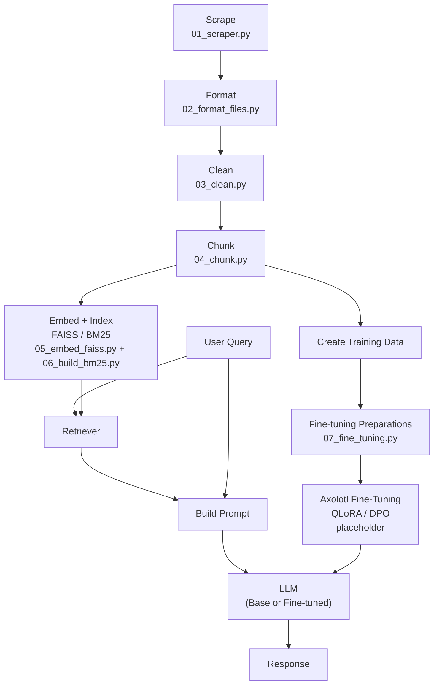

# wm_bot

## Project Goal
The goal of this project is to collect and organize information from William & Mary websites so we can build a system that answers questions about William & Mary. 

We scrape relevant webpages, extract clean text, and store the results in a structured format that can later be used for model training or retrieval. 

---

## Project Structure
- `scripts/` -> code for setup and scraping
- `data_raw/` -> raw scraped outputs (JSONL)
- `data_clean/` -> cleaned/processed data 
- `metadata/` -> seed URLs and tracking files
- `logs/` -> run logs and error logs 
- `README.md` -> project overview and instructions
- `wmbot-env.yaml` -> environment structure for the scraping env (no trafilatura)
- `llm-env.yaml` -> environment structure for the llm env
---

## Scripts 
- `00_set_up_conda.sh` -> sets up the scraper conda environment (use other script)
- `00_scraper_env_create.sh` -> creates wmbot-env for webscraping and data collection
- `00_create_llm_env.sh` -> creates llm-env for fine-tuning with axolotl
- `01_scraper.py` -> main scraper for collecting W&M webpages
- `02_format_files.py` -> currently editing. Prepares files for embeddings
- `03_cosine.py` -> computes cosine similarity
- `03_fine_tuning` -> 
- `chunk_data.py` -> takes formatted json and extracts chunks (better performance)
- `build_bm25.py` -> Creates pickle file for bm25 filtering (used in retrieval)
- `embed_faiss.py` -> Creates pickle file for faiss semantic search (used in retrieval) 
- `submit.sh` -> runs scraping jobs on HPC using SLURM
- `submit_cleaner.sh` -> runs formatting/cleaning jobs on HPC
- `archive/` -> older or unused scripts

---

## Pipeline Overview 
1. Define seed URLs in `metadata/seed_urls.txt`
2. Run scraper to collect webpage data
3. Save raw output to `data_raw/`
4. Format and clean outputs into `data_clean/`
5. Prepare dataset for model use
6. Use data with Axolotl for model training



---

## Inputs
- Seed URLs from `metadata/seed_urls.txt`

---

## Outputs
- Raw text files in `data_raw/`
- Cleaned/processed files in `data_clean/`

---

## How to Run 

### Local

```bash
cd wm_bot

# Create environments
bash scripts/00_scraper_env_create.sh
bash scripts/00_create_llm_env.sh

# Activate scraper environment
conda activate wmbot-env

python scripts/01_scraper.py
python scripts/02_format_files.py

conda deactivate

# Activate LLM environment
conda activate llm-env
conda deactivate
```

### HPC (SLURM)

Run scraping:
```bash
sbatch scripts/submit.sh
```

Run cleaning/formatting:
```bash
sbatch scripts/submit_cleaner.sh
```

---

## Scraper Overview
The scraper:
- starts from selected W&M seed URLs
- uses `trafilatura` to extract readable webpage content
- follows links within wm.edu to find more pages
- skips non-text files (PDFs, images, etc.)
- saves results in JSONL format 

---

## Environments
### wm-bot env
This environment is used for the web-scraping/data collection steps.

Required Packages:
name: wmbot-env
channels:
  - conda-forge
dependencies:
  - _openmp_mutex=4.5
  - backports.zstd=1.3.0
  - beautifulsoup4=4.14.3
  - brotli-python=1.2.0
  - bzip2=1.0.8
  - ca-certificates=2026.2.25
  - certifi=2026.2.25
  - charset-normalizer=3.4.7
  - h2=4.3.0
  - hpack=4.1.0
  - hyperframe=6.1.0
  - icu=78.3
  - idna=3.11
  - ld_impl_linux-64=2.45.1
  - libblas=3.11.0
  - libcblas=3.11.0
  - libexpat=2.7.5
  - libffi=3.5.2
  - libgcc=15.2.0
  - libgfortran=15.2.0
  - libgfortran5=15.2.0
  - libgomp=15.2.0
  - liblapack=3.11.0
  - liblzma=5.8.2
  - libmpdec=4.0.0
  - libopenblas=0.3.32
  - libsqlite=3.52.0
  - libstdcxx=15.2.0
  - libuuid=2.42
  - libzlib=1.3.2
  - ncurses=6.5
  - numpy=2.4.3
  - openssl=3.6.1
  - pandas=3.0.2
  - pip=26.0.1
  - pysocks=1.7.1
  - python=3.14.3
  - python-dateutil=2.9.0.post0
  - python_abi=3.14
  - readline=8.3
  - requests=2.33.1
  - six=1.17.0
  - soupsieve=2.8.3
  - tk=8.6.13
  - typing-extensions=4.15.0
  - typing_extensions=4.15.0
  - tzdata=2025c
  - urllib3=2.6.3
  - zstd=1.5.7

Environment is created using:
- original environment creation (no packages) (00_set_up_conda.sh)
- create environment from yaml with extra packages (00_scraping_env_create.sh)

### llm-env
This environment is used for llm fine-tuning using axolotl.

Required Packages:
name: llm-env
channels:
  - conda-forge
dependencies:
  - _openmp_mutex=4.5
  - bzip2=1.0.8
  - ca-certificates=2026.2.25
  - icu=78.3
  - ld_impl_linux-64=2.45.1
  - libexpat=2.7.5
  - libffi=3.5.2
  - libgcc=15.2.0
  - libgcc-ng=15.2.0
  - libgomp=15.2.0
  - liblzma=5.8.2
  - libnsl=2.0.1
  - libsqlite=3.52.0
  - libstdcxx=15.2.0
  - libuuid=2.42
  - libxcrypt=4.4.36
  - libzlib=1.3.2
  - ncurses=6.5
  - openssl=3.6.2
  - packaging=26.0
  - pip=26.0.1
  - python=3.11.15
  - readline=8.3
  - setuptools=82.0.1
  - tk=8.6.13
  - wheel=0.46.3
  - zstd=1.5.7
  - pip:
      - absl-py==2.4.0
      - accelerate==1.13.0
      - addict==2.4.0
      - adlfs==2026.2.0
      - aiobotocore==2.26.0
      - aiofiles==24.1.0
      - aiohappyeyeballs==2.6.1
      - aiohttp==3.13.5
      - aioitertools==0.13.0
      - aiosignal==1.4.0
      - annotated-doc==0.0.4
      - annotated-types==0.7.0
      - antlr4-python3-runtime==4.13.2
      - anyio==4.13.0
      - art==6.5
      - attrs==26.1.0
      - authlib==1.6.9
      - axolotl==0.16.1
      - axolotl-contribs-lgpl==0.0.7
      - axolotl-contribs-mit==0.0.6
      - azure-core==1.39.0
      - azure-datalake-store==0.0.53
      - azure-identity==1.25.3
      - azure-storage-blob==12.28.0
      - backoff==2.2.1
      - bitsandbytes==0.49.1
      - botocore==1.41.5
      - brotli==1.2.0
      - cbor2==5.9.0
      - certifi==2026.2.25
      - cffi==2.0.0
      - chardet==5.2.0
      - charset-normalizer==3.4.7
      - circuitbreaker==2.1.3
      - click==8.3.2
      - colorama==0.4.6
      - coloredlogs==15.0.1
      - cryptography==46.0.7
      - dataproperty==1.1.0
      - datasets==4.5.0
      - decorator==5.2.1
      - dill==0.4.0
      - distro==1.9.0
      - einops==0.8.2
      - evaluate==0.4.1
      - fastapi==0.135.3
      - fastcore==1.12.34
      - ffmpy==1.0.0
      - filelock==3.25.2
      - fire==0.7.1
      - fla-core==0.4.1
      - flash-linear-attention==0.4.1
      - frozenlist==1.8.0
      - fsspec==2025.10.0
      - gcsfs==2025.10.0
      - gitdb==4.0.12
      - gitpython==3.1.46
      - google-api-core==2.30.2
      - google-auth==2.49.1
      - google-auth-oauthlib==1.3.1
      - google-cloud-core==2.5.1
      - google-cloud-storage==3.10.1
      - google-crc32c==1.8.0
      - google-resumable-media==2.8.2
      - googleapis-common-protos==1.74.0
      - gradio==6.11.0
      - gradio-client==2.4.0
      - groovy==0.1.2
      - grpcio==1.80.0
      - grpclib==0.4.9
      - h11==0.16.0
      - h2==4.3.0
      - hf-gradio==0.3.0
      - hf-transfer==0.1.9
      - hf-xet==1.3.2
      - hpack==4.1.0
      - httpcore==1.0.9
      - httpx==0.28.1
      - huggingface-hub==1.7.0
      - humanfriendly==10.0
      - hyperframe==6.1.0
      - idna==3.11
      - immutabledict==4.2.0
      - isodate==0.7.2
      - itsdangerous==2.2.0
      - jinja2==3.1.6
      - jmespath==1.1.0
      - joblib==1.5.3
      - jsonlines==4.0.0
      - jsonschema==4.26.0
      - jsonschema-specifications==2025.9.1
      - kernels==0.12.2
      - langdetect==1.0.9
      - liger-kernel==0.7.0
      - llvmlite==0.47.0
      - lm-eval==0.4.11
      - lxml==6.0.3
      - markdown==3.10.2
      - markdown-it-py==4.0.0
      - markupsafe==3.0.3
      - mbstrdecoder==1.1.4
      - mdurl==0.1.2
      - mistral-common==1.11.0
      - modal==1.3.0.post1
      - more-itertools==11.0.1
      - mpmath==1.3.0
      - msal==1.36.0
      - msal-extensions==1.3.1
      - multidict==6.7.1
      - multiprocess==0.70.18
      - narwhals==2.19.0
      - networkx==3.6.1
      - nltk==3.9.4
      - numba==0.65.0
      - numpy==2.3.5
      - nvidia-cublas-cu12==12.8.4.1
      - nvidia-cuda-cupti-cu12==12.8.90
      - nvidia-cuda-nvrtc-cu12==12.8.93
      - nvidia-cuda-runtime-cu12==12.8.90
      - nvidia-cudnn-cu12==9.10.2.21
      - nvidia-cufft-cu12==11.3.3.83
      - nvidia-cufile-cu12==1.13.1.3
      - nvidia-curand-cu12==10.3.9.90
      - nvidia-cusolver-cu12==11.7.3.90
      - nvidia-cusparse-cu12==12.5.8.93
      - nvidia-cusparselt-cu12==0.7.1
      - nvidia-ml-py==12.560.30
      - nvidia-nccl-cu12==2.27.3
      - nvidia-nvjitlink-cu12==12.8.93
      - nvidia-nvtx-cu12==12.8.90
      - oauthlib==3.3.1
      - oci==2.170.0
      - ocifs==1.3.2
      - openenv-core==0.1.0
      - optimum==1.16.2
      - orjson==3.11.8
      - pandas==2.3.3
      - pathvalidate==3.3.1
      - peft==0.18.1
      - pillow==11.3.0
      - platformdirs==4.9.6
      - plotly==6.6.0
      - portalocker==3.2.0
      - posthog==6.7.11
      - propcache==0.4.1
      - proto-plus==1.27.2
      - protobuf==6.33.6
      - psutil==7.2.2
      - pyarrow==23.0.1
      - pyasn1==0.6.3
      - pyasn1-modules==0.4.2
      - pycountry==26.2.16
      - pycparser==3.0
      - pydantic==2.12.5
      - pydantic-core==2.41.5
      - pydantic-extra-types==2.11.2
      - pydub==0.25.1
      - pygments==2.20.0
      - pyjwt==2.12.1
      - pyopenssl==26.0.0
      - pytablewriter==1.2.1
      - python-dateutil==2.9.0.post0
      - python-dotenv==1.0.1
      - python-multipart==0.0.24
      - pytz==2026.1.post1
      - pyyaml==6.0.3
      - referencing==0.37.0
      - regex==2026.4.4
      - requests==2.33.1
      - requests-oauthlib==2.0.0
      - responses==0.18.0
      - rich==14.3.3
      - rouge-score==0.1.2
      - rpds-py==0.30.0
      - s3fs==2025.10.0
      - sacrebleu==2.6.0
      - safehttpx==0.1.7
      - safetensors==0.7.0
      - schedulefree==1.4.1
      - scikit-learn==1.8.0
      - scipy==1.17.1
      - semantic-version==2.10.0
      - sentence-transformers==5.4.0
      - sentencepiece==0.2.1
      - sentry-sdk==2.57.0
      - shellingham==1.5.4
      - six==1.17.0
      - smmap==5.0.3
      - sqlitedict==2.1.0
      - starlette==1.0.0
      - sympy==1.14.0
      - synchronicity==0.11.1
      - tabledata==1.3.4
      - tabulate==0.10.0
      - tcolorpy==0.1.7
      - tensorboard==2.20.0
      - tensorboard-data-server==0.7.2
      - termcolor==3.3.0
      - threadpoolctl==3.6.0
      - tiktoken==0.12.0
      - tokenizers==0.22.2
      - toml==0.10.2
      - tomlkit==0.13.3
      - torch==2.8.0
      - torchao==0.17.0
      - torchaudio==2.5.1+cu121
      - torchvision==0.20.1+cu121
      - tqdm==4.67.3
      - trackio==0.20.2
      - transformers==5.5.0
      - triton==3.4.0
      - trl==0.29.0
      - typepy==1.3.4
      - typer==0.24.1
      - types-certifi==2021.10.8.3
      - types-toml==0.10.8.20260408
      - typing-extensions==4.15.0
      - typing-inspection==0.4.2
      - tzdata==2026.1
      - urllib3==2.6.3
      - uvicorn==0.44.0
      - wandb==0.25.1
      - watchfiles==1.1.1
      - werkzeug==3.1.8
      - word2number==1.1
      - wrapt==1.17.3
      - xformers==0.0.32.post2
      - xxhash==3.6.0
      - yarl==1.23.0
      - zstandard==0.22.0

Environment is created using:
- create environment with extra packages (00_create_llm_env.sh)

---

## Axolotl Integration
The cleaned dataset will be used with the Axolotl framework to train or fine-tune a model for answering questions about William & Mary.

## Notes
- Scraper is currently limited by `max_pages` for testing
- Designed to scale on HPC (SciClone) 
- Logs can be saved for debugging and tracking runs 

