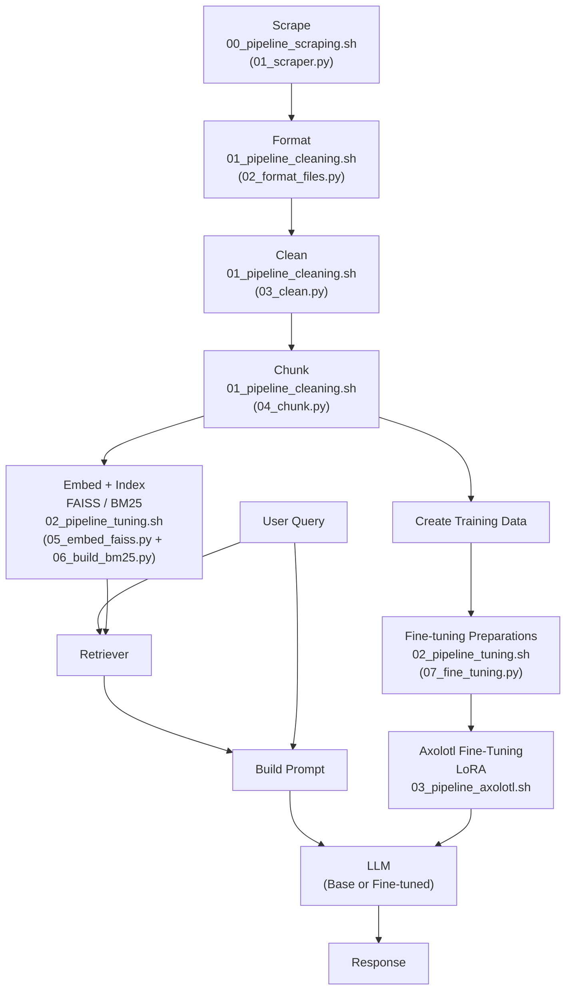
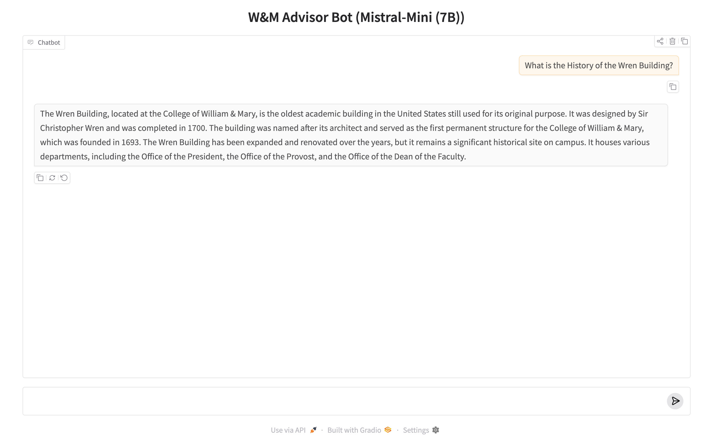

# wm_bot

> A retrieval-augmented generation (RAG) chatbot for answering questions about William & Mary, powered by a 3-stage hybrid retrieval pipeline (FAISS + BM25 + CrossEncoder reranking) and a QLoRA fine-tuned LLM (Llama 3, Gemma, or Mistral) served via a Gradio UI.

**GitHub Repository:** https://github.com/sjhendricks/wm_bot

--- 

## Project Goal
The goal of this project is to collect and organize information from William & Mary websites to build a system that answers questions about William & Mary.

We scrape relevant webpages, extract clean text, and store results in a structured format used for retrieval-augmented generation (RAG). A 3-stage hybrid retrieval system (FAISS → BM25 → CrossEncoder reranking) fetches the most relevant passages, which are passed as context to a QLoRA fine-tuned LLM to generate grounded answers via a Gradio interface.

The pipeline supports fine-tuning and inference with three interchangeable models: **Llama 3**, **Gemma**, and **Mistral**.

---

## Project Structure

```
wm_bot/
├── scripts/                    # Pipeline scripts
├── envs/
│   ├── archive/
│   ├── requirements-wmbot.txt
│   ├── wmbot-env_full.yaml
│   ├── wmbot-stable.yaml
│   └── llm-env_new.yaml
├── data/
│   ├── raw/                    # Scraped files by site
│   ├── clean/                  # cleaned.json + any formatted text
│   ├── embeddings/             # embeddings
│   ├── fine_tuning/            # fine-tuning.jsonl + formatted-fine-tuning.jsonl
│   └── rag/                    # chunks.json, faiss.index, bm25.pkl
├── bot_test_resources/                     
│   ├── gemma/
│   │   ├── axolotl_gemma.yaml
│   │   ├── gemma_prepared/
│   │   ├── qlora-out/
│   │   └── gemma_conversation_format.py
│   ├── llama/
│   │   ├── axolotl_llama.yaml
│   │   ├── llama_prepared/
│   │   └── qlora-out/
│   └── mistral/
│       ├── axolotl_mini.yaml
│       ├── mistral_prepared/
│       └── qlora-out/
├── 00_pipeline_envs.sh
├── 00_pipeline_scraping.sh/ 
├── 01_pipeline_cleaning.sh/ 
├── 02_pipeline_tuning.sh/ 
├── 03_pipeline_axolotl.sh/ 
├── metadata/                   # Seed URLs
├── logs/                       # Run logs and error logs
├── bot_ui.ipynb
└── README.md

```
---

## Scripts

### Core Pipeline

| Script | Description | 
|--------|-------------|
| `01_scraper.py` | scrapes data from different sites (listed in metadata) |
| `02_format_files.py` | uses trifilatura to clean html extras from sites |
| `03_clean.py` | cleans the data |
| `04_chunk.py` | chunks the data |
| `05_embed_faiss.py` | FAISS embeddings|
| `06_build_bm25.py` | builds BM25 for retrieval |
| `07_fine_tuning.py` | fine-tunes |
| `08_conversation_format.py` | formats jsonl for input to axolotl | 
| `08_wm_bot_rag.py` | RAG chatbot | 

### Environment Setup

| Script | Description | 
|--------|-------------|
|`00_pipeline_envs.sh` | creates all needed envs using yaml files |
| `00_create_scraping_env.sh` | manually creates environment for scraping and preparing data |
| `00_create_llm_env.sh` | manually creates environment for training the llm using axolotl |
| `00_create_run_bot_env.sh` | manually creates environment for running the bot using pytorch | 

### HPC (SLURM) Submit Scripts 

| Script | Description | 
|--------|-------------|
| `00_pipeline_scraping.sh` | submits scraping job |
| `01_pipeline_cleaning.sh` | submits formatting and indexing job |
| `02_pipeline_tuning.sh` | submits fine-tuning dataset job **REQUIRES HF TOKEN** |
| `03_pipeline_axolotl.sh` | submits fine-tuning with selectable model (see Model Selection) **REQUIRES HF TOKEN** |

### Supporting Scripts

| Script | Description |
|--------|-------------|
| `gemma_conversation_format.py` | must be run when using gemma model to account for specific formatting |
| `bot_ui.ipynb` | downloadable collab file to run bot locally **REQUIRES HF TOKEN AND T4 RUNTIME** |
| `untuned_{MODEL NAME}_bot.py` | scripts to run bot using base model, used for debugging, comparison, and evaluation |

---

## Pipeline Overview 



---

## Retrieval Architecture

The retrieval system uses 3 stages to maximize answer quality:

1. **FAISS semantic search** — encodes the query with `all-MiniLM-L6-v2` and retrieves the top-K semantically similar chunks
2. **BM25 keyword search** — runs a parallel keyword search to catch exact-match results that semantic search may miss
3. **CrossEncoder reranking** — combines and deduplicates both result sets, reranks with `ms-marco-MiniLM-L-6-v2`, and passes the top 3 passages as LLM context

---

## Model
 
The pipeline supports three interchangeable models for fine-tuning and inference:

```bash
sbatch scripts/submit_axolotl_model.sh llama    # Meta-Llama-3-8B-Instruct
sbatch scripts/submit_axolotl_model.sh gemma    # Gemma
sbatch scripts/submit_axolotl_model.sh mistral  # Mistral (default)
```

| Component | Value |
|-----------|-------|
| Supported LLMs | Llama 3 8B Instruct, Gemma, Mistral |
| Default model | Mistral |
| Fine-tuning method | QLoRA via Axolotl |
| Adapter path | `bot_test_resources/{MODEL NAME}/qlora-out/` |
| Embedding model | `sentence-transformers/all-MiniLM-L6-v2` |
| Reranker | `cross-encoder/ms-marco-MiniLM-L-6-v2` |
| UI/Gradio | `{MODEL NAME}_bot.py` or `Google Collab Notebook` |

System prompt: *"You are a professional William & Mary Academic Advisor. Your sole purpose is to assists students with W&M-related inquiries. If a student asks a question that is unrelated to William & Mary, you must politely decline to answer and offer to help them with their academic journey instead. Do not provide general knowledge or instructions outside of this scope."*

---

## Data Sources

Our dataset was scraped from 14 sources spanning W&M's official web presence, affiliated institutions, and the surrounding Williamsburg community. This includes the main W&M site, course catalog, library, law school, Mason School of Business, CDSP, VIMS, and ScholarWorks, as well as campus life sources like the Flat Hat student newspaper, dining, and recreation. We also incorporated content from Colonial Williamsburg and Visit Williamsburg to provide broader local context.

Scraped content is organized by site under `data/raw/`:

| Source | Directory |
|--------|-----------|
| W&M main site | `wm_edu/` |
| Course catalog | `catalog/` |
| W&M news | `news/` |
| W&M library | `wm_library/` |
| Law school | `law/` |
| Flat Hat (student newspaper) | `flathat/` |
| Dining | `dininghub/` |
| Recreation | `rec/` |
| VIMS | `vims/` |
| Visit Williamsburg | `visit_wmburg/` |
| Mason School of Business | `mason/` |
| CDSP | `cdsp/` |
| Colonial Williamsburg | `cw/` |
| ScholarWorks | `scholarworks/` |

---

## How to Run

It is strongly encouraged to run the bot using the `bot_ui.ipynb` file in Google Collab, utilizing a T4 runtime. The weights and data have been uploaded to a Hugging Face Space and are accessible from there. All you have to do is put your Hugging Face read token in the Collab secrets as HF_TOKEN. 

If you want to run the process on your own data, continue on reading this section. The whole process may take up to **15 hours** and requires special access to the **Meta-Llama-3-8B-Instruct Model**. If you do not have access, you *must* run the bot through the script `bot_ui.ipynb`.

### HPC (SLURM)

```bash
# Set up all 3 environments
bash 00_pipeline_envs.sh

# Scraping (takes metadata from data/metadata/metadata.csv)
sbatch 00_pipeline_scraping.sh

# Cleaning/formatting (run stages together)
sbatch 01_pipeline_cleaning.sh  # runs scripts 02–06

# Fine-tuning
sbatch 02_pipeline_tuning.sh

# Training via axolotl
sbatch 03_pipeline_axolotl.sh

# Launch chatbot interactively, replace {MODEL NAME} with model option of choice (gemma, llama, mistral). Mistral is the only model that does not require special access.

srun -p batch --gres=gpu:1 --mem=64G -t 01:00:00 --pty bash

# When connected to a node
module load miniforge3
module load cuda
source "$(conda info --base)/etc/profile.d/conda.sh"
conda activate wmbot-stable
python bot_test_resources/{MODEL NAME}_bot.py
```

### What Happens in the HPC Pipeline

```bash
cd wm_bot

# Create environments
bash scripts/00_pipeline_envs.sh

# Steps 1–4: Scrape + process data
conda activate wmbot-env
python scripts/01_scraper.py
python scripts/02_format_files.py
python scripts/03_clean.py
python scripts/04_chunk.py

# Steps 5–6: Build retrieval indexes
python scripts/05_embed_faiss.py
python scripts/06_build_bm25.py
conda deactivate

# Steps 7–8: Prepare fine-tuning data
conda activate llm-env
python scripts/07_fine_tuning.py
python scripts/08_conversation_format.py
conda deactivate

# Step 9: Launch chatbot
conda activate wmbot-stable
srun -p batch --gres=gpu:1 --mem=64G -t 01:00:00 --pty bash
python bot_test_resources/[MODEL NAME]_bot.py
```

---

## Environments

If `00_pipeline_envs.sh` does not work or you are having issues with the environment, there are scripts to manually install the necessary libraries and versions found below.

### `wmbot-env` - Scraping & Processing
Used for steps 1–4.
```bash
bash scripts/00_create_scraping_env.sh 
```
Key packages: `trafilatura`, `beautifulsoup4`, `requests`, `pandas`, `numpy`

### `llm-env` - Fine-tuning via Axolotl
Used for steps 5–8.
```bash
bash scripts/00_create_llm_env.sh
```
Key packages: `axolotl`, `torch`, `transformers`, `peft`, `trl`, `accelerate`

### `wmbot-env` - Inference & UI
Used for step 9.
```bash
bash scripts/00_create_run_bot_env.sh
```
Key packages: `faiss`, `sentence-transformers`, `gradio`, `rank-bm25`, `peft`, `torch`

---
## Demo & Results

### Example Chatbot Outputs

| User Query | Bot Response |
|------------|--------------|
| *"What majors are in arts & sciences?"* | *"At William & Mary, the Arts & Sciences majors include but are not limited to: Anthropology, Biology, Chemistry, Classical Studies, Computer Science, Economics, English, Environmental Science, Geology, History, Mathematics, Physics, Psychology, Sociology, and Theatre, Speech, and Dance. However, this is not an exhaustive list. I would recommend visiting the W&M website or contacting the appropriate department or faculty member for more information on majors in Arts & Sciences."* |
| *"What resources can I use at the Swem Library?"* | *"The Swem Library offers a variety of resources to help you with your academic journey. You can access databases, e-books, journals, and newspapers, as well as physical books, DVDs, and more. Additionally, the library has a number of study spaces, including individual study rooms, group study rooms, and quiet study areas. You can also visit the library's website to see what events are happening, such as workshops and lectures. For more information, you can visit the library's website or speak with a librarian."* |
| *"What degrees can I pursue at the Business School at W&M?"* | *"The Business School, also known as the Raymond A. Mason School of Business, offers undergraduate degrees in Business Administration. Specifically, you can pursue a Business Administration degree with majors in Accounting, Business Analytics, Business Management, Economics, Entrepreneurship, International Business, Marketing, and Real Estate. Additionally, the Business School offers a joint degree program with the School of Law, which allows students to earn both a Juris Doctor (J.D.) and a Master of Business Administration (M.B.A.) in approximately six years. For more information, I recommend visiting the Business School's website or reaching out to an academic advisor."* |

### Evaluation 

We evaluated the chatbot on retrieval quality, answer relevance, and overall system performance using representative William & Mary queries across academics, campus resources, dining, libraries, and administrative topics.

#### Key Findings
- The **hybrid retrieval pipeline** (FAISS + BM25 + CrossEncoder reranking) improved retrieval accuracy compared to using semantic or keyword search alone
- **CrossEncoder reranking** improved precision by selecting the most relevant passages before generation
- **QLoRA fine-tuning** improved response quality, domain specificity, and formatting for W&M-related questions
- The chatbot successfully generated grounded responses for a wide range of campus-related queries through the Gradio interface
#### Future Improvements
- Add automated retrieval metrics such as Recall\@K and MRR
- Expand the scraped dataset coverage
- Conduct structured user testing and evaluation


### User Interface 

Below is the gradio interface that can be run through the .ipynb



## Team Contributions

| Member | Contributions |
|--------|---------------|
| Pranjali Gupta | Scraping scripts, Embeddings, FAISS Index and BM25 implementation|
| Sarah Hendricks| Conda/environments setup, base Axolotl implementation, README.md work |
| Paulina Skurzak | |
| Hannah Sweazey | Data cleaning, model fine-tuning, Axolotl training, pipeline scripts, backend UI, frontend UI, README.md work|

---

## Known Limitations
- Scraping is scoped to selected W&M sites; not a full site crawl
- Conda environment and package versions are highly specific. We have provided a few methods for setting up environments, and package versions are listed in the yaml/txt files in the envs folder
- Missing or incomplete scraped data occasionally produced vague or generic responses
- Ambiguous queries reduced retrieval quality and answer precision
- Benchmarking and automated evaluation metrics are still under development

---

## Key Dependencies

| Tool | Purpose | Citation |
|------|---------|----------|
| trafilatura | Web text extraction | [Barbaresi (2021)](#trafilatura) |
| FAISS | Semantic vector search | [Johnson et al. (2019)](#faiss) |
| rank-bm25 | Keyword retrieval | [Brown (2020)](#rank-bm25) |
| sentence-transformers | Text embeddings | [Reimers & Gurevych (2019)](#sentence-transformers) |
| CrossEncoder | Retrieval reranking | [Reimers & Gurevych (2019)](#crossencoder) |
| Axolotl | Fine-tuning framework | [Axolotl (2023)](#axolotl) |
| PyTorch | GPU training | [Ansel et al. (2024)](#pytorch) |
| PEFT | Parameter-efficient tuning | [Mangrulkar et al. (2022)](#peft) |
| BeautifulSoup4 | Data scraping | [Richardson (2007)](#beautifulsoup4) |
| Gradio | Chatbot UI | [Abid et al. (2019)](#gradio) |

---

## References

### Trafilatura
<a id="trafilatura"></a>
```bibtex
@inproceedings{barbaresi-2021-trafilatura,
  title = {Trafilatura: A Web Scraping Library and Command-Line Tool for Text Discovery and Extraction},
  author = {Barbaresi, Adrien},
  booktitle = {Proceedings of the ACL System Demonstrations},
  pages = {122--131},
  year = {2021},
  publisher = {Association for Computational Linguistics},
  url = {https://aclanthology.org/2021.acl-demo.15}
}
```

### FAISS
<a id="faiss"></a>
```bibtex
@article{johnson2019billion,
  title = {Billion-scale similarity search with GPUs},
  author = {Johnson, Jeff and Douze, Matthijs and Jégou, Hervé},
  journal = {IEEE Transactions on Big Data},
  volume = {7},
  number = {3},
  pages = {535--547},
  year = {2019},
  publisher = {IEEE}
}
```

### Rank-BM25
<a id="rank-bm25"></a>
```bibtex
@software{rank_bm25,
  author = {Dorian Brown},
  title = {Rank-BM25: A Collection of BM25 Algorithms in Python},
  year = {2020},
  publisher = {Zenodo},
  doi = {10.5281/zenodo.4520057},
  url = {https://doi.org/10.5281/zenodo.4520057}
}
```

### Sentence-Transformers
<a id="sentence-transformers"></a>
```bibtex
@inproceedings{reimers-2019-sentence-bert,
  title = {Sentence-BERT: Sentence Embeddings using Siamese BERT-Networks},
  author = {Reimers, Nils and Gurevych, Iryna},
  booktitle = {Proceedings of EMNLP},
  year = {2019},
  publisher = {Association for Computational Linguistics},
  url = {https://arxiv.org/abs/1908.10084}
}
```

### CrossEncoder
<a id="crossencoder"></a>
```bibtex
@inproceedings{reimers-2019-sentence-bert,
  title = {Sentence-BERT: Sentence Embeddings using Siamese BERT-Networks},
  author = {Reimers, Nils and Gurevych, Iryna},
  booktitle = {Proceedings of EMNLP},
  year = {2019},
  publisher = {Association for Computational Linguistics},
  url = {https://arxiv.org/abs/1908.10084}
}
```

### Axolotl
<a id="axolotl"></a>
```bibtex
@software{axolotl,
  title = {Axolotl: Open Source LLM Post-Training},
  author = {Axolotl maintainers and contributors},
  year = {2023},
  url = {https://github.com/axolotl-ai-cloud/axolotl},
  license = {Apache-2.0}
}
```

### PyTorch
<a id="pytorch"></a>
```bibtex
@inproceedings{ansel2024pytorch2,
  title = {PyTorch 2: Faster Machine Learning Through Dynamic Python Bytecode Transformation and Graph Compilation},
  author = {Ansel, Jason and Yang, Edward and He, Horace and others},
  booktitle = {ASPLOS '24},
  year = {2024},
  publisher = {ACM},
  doi = {10.1145/3620665.3640366},
  url = {https://docs.pytorch.org/assets/pytorch2-2.pdf}
}
```

### PEFT
<a id="peft"></a>
```bibtex
@misc{peft,
  title = {PEFT: Parameter-Efficient Fine-Tuning methods},
  author = {Mangrulkar, Sourab and Gugger, Sylvain and others},
  year = {2022},
  howpublished = {\url{https://github.com/huggingface/peft}}
}
```

### BeautifulSoup4
<a id="beautifulsoup4"></a>
```bibtex
@article{richardson2007beautiful,
  title = {Beautiful Soup Documentation},
  author = {Richardson, Leonard},
  journal = {April},
  year = {2007}
}
```

### Gradio
<a id="gradio"></a>
```bibtex
@article{abid2019gradio,
  title = {Gradio: Hassle-free sharing and testing of ML models in the wild},
  author = {Abid, Abubakar and Abdalla, Ali and Abid, Ali and others},
  year = {2019},
  doi = {10.48550/arXiv.1906.02569},
  url = {https://arxiv.org/abs/1906.02569}
}
```
