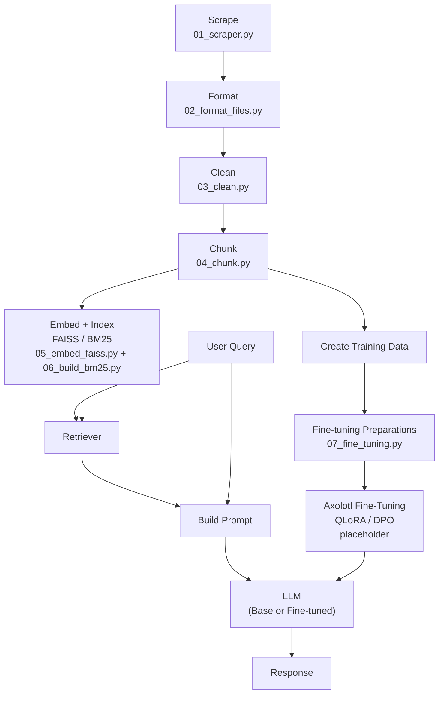

```mermaid
flowchart TD

    %% ===== DATA PIPELINE =====
    A["Scrape<br/>01_scraper.py"] --> 
    B["Format<br/>02_format_files.py"] --> 
    C["Clean<br/>03_clean.py"] --> 
    D["Chunk<br/>04_chunk.py"]

    %% ===== RETRIEVAL INDEX =====
    D --> E["Embed + Index<br/>FAISS / BM25<br/>05_embed_faiss.py + 06_build_bm25.py"]

    %% ===== TRAINING =====
    D --> L["Create Training Data"]
    L --> M["Fine-tuning Preparations<br/>07_fine_tuning.py"]
    M --> N["Axolotl Fine-Tuning<br/>QLoRA / DPO<br/> placeholder"]

    %% ===== INFERENCE =====
    G[User Query] --> H[Retriever]
    E --> H

    H --> I[Build Prompt]
    G --> I

    I --> J["LLM<br/>(Base or Fine-tuned)"]
    J --> K[Response]

    N --> J
```
